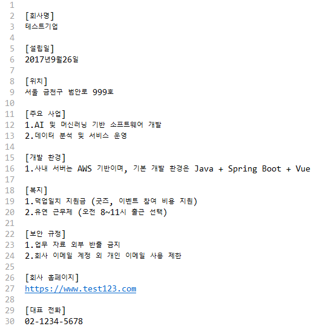

# Langchain4j Example

1. Langchain4j & Websocket 활용 RAG 기반 AI 챗봇 구현  
2. RDBMS 연동 제품 리뷰 요약 및 키워드 추출  

- 로컬에 [Ollama](https://ollama.com/download) 설치 후 실행
- 언어 모델 : gemma3:4b
- 임베딩 모델 : granite-embedding:278m
- 임베딩 스토어 : ChromaDB + Docker

# Langchain4j & Websocket 활용 RAG 기반 AI 챗봇 구현
[참고 문서]  
  
[대화 내용]  
  

# RDBMS 연동 제품 리뷰 요약 및 키워드 추출
[리뷰 더미데이터 500개]  
  
[추출 결과]  
  
